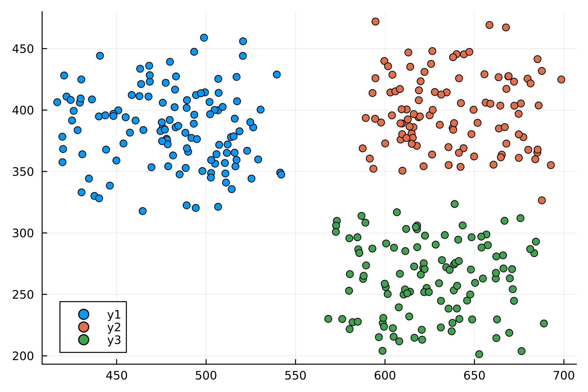

# Parallel Regularized K-Means Algorithm
This is a Julia implementation of a parallel regularized k-means algorithm described in [[1]](#1).



## Usage
A usage example is provided in `main.jl`, which can be run with `julia --project=. main.jl` or, preferably, interactively in the REPL.

The parameter `n_threads` in the code does not determine how many processor threads are going to be used, it only determines in how many parts the data is split.
To specify the number `n` of threads the flag `--threads=n` should be added when launching Julia.
```julia
using CSV

include("src/cluster.jl")
using .RegularizedClustering

## Parameters & Data
file = CSV.File(open("data/data_2d.csv"))
data = hcat(file.x, file.y)
iter_max = 10
tol = 0.1

## Sequential Version
λ = 10_000.0
model = Model(data, λ, iter_max, tol)
run_model!(model)
visualize(model)

## Parallel Version
n_threads = 8
λ_c = 10_000.0
λ_g = 1_000_000.0
λ_r = 10.0
p_model = ParallelModel(n_threads, data, λ_c, λ_g, iter_max, tol; parallel=true)
run_model!(p_model)
refine!(p_model, λ_r)
visualize(p_model)
```

## References
<a id="1">[1]</a> 
Benjamin McLaughlin and Sung Ha Kang (2023). 
A new parallel adaptive clustering and its application to streaming data.
